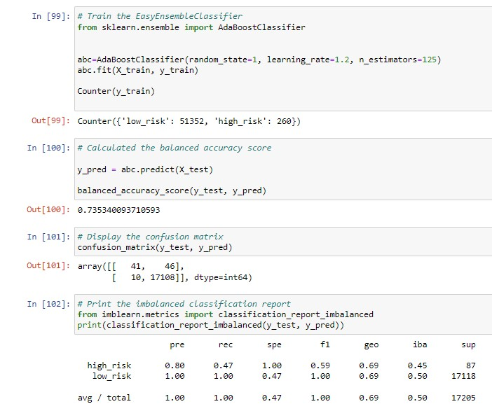

# Credit_Risk_Analysis

## Overview
In this module, we will be using machine learning to build a model that can predict whether an applicant is high risk or low risk. Using the imbalanced-learn and scikit-learn libraries we can apply RandomOverSampler, SMOTE, ClusterCentroids, SMOTEENN, BalancedRandomForestClassifier and EasyEnsembleClassifier algorithms to train, then predict outcomes based on the features that come with our dataset, LoanStats_2019Q1.
## Results
### Resampling
-	Undersampling with the ClusterCentroid algorithm largely underperformed, the absence of data reduced the models ability to predict outcomes accurately. The F1 score of 0.6 was the lowest of any algorithm used in this analysis, it also had the lowest recall of high-risk applicants
-	The SMOTE algorithm had a better recall than the RandomOversampler, even though Randomoversampler had a higher F-1 score
-	The SMOTEEN algorithm had the best recall of high-risk applicants out of the resampling techniques

### Ensemble
-	Ensemble learners predicted high-risk applicants with better precision, and very high f-scores
-	The BalancedRandomForestClassifier had similar results as the oversampling techniques, but with twice the precision
-	The EasyEnsembleClassifier had the highest f-score and precision for predicting high-risk applicants

## Summary
The EasyEnsembleClassifer model would be ideal for more aggressive business models, but the safest and business model would be the SMOTEENN algorithm. The trade off is to forego the profit of ~7000 low risk applicants, by taking reducing the potential loss incurred by having ~20 additional high-risk applicants. Choosing from that trade-off would require in depth knowledge of the business. From a technical perspective, our job here is done. We have utilized machine learning to provide a tool that enable’s the business to do what they do best.
